# معرفی Apache JMeter

## JMeter چیست؟

JMeter یک ابزار رایگان و متن‌باز است که برای تست عملکرد و بارگذاری برنامه‌ها به کار می‌رود. این ابزار توسط Apache توسعه داده شده و با زبان Java نوشته شده است. با JMeter می‌توانیم ببینیم وقتی کاربران زیادی هم‌زمان از یک برنامه استفاده می‌کنند، سیستم چگونه عمل می‌کند و آیا سرعت و پایداری کافی دارد یا نه.

## چرا از JMeter استفاده می‌کنیم؟

تست عملکرد: می‌خواهیم مطمئن شویم سیستم در شرایط عادی و حتی فشار زیاد، پاسخگو است.

تست بارگذاری: با شبیه‌سازی تعداد زیادی کاربر هم‌زمان، ظرفیت سیستم را بسنجیم.

تست استرس: بفهمیم سیستم در مقابل بار سنگین چه زمانی دچار مشکل می‌شود.

تست API: تست کردن وب‌سرویس‌های REST و SOAP برای اطمینان از عملکرد درست.

تست توزیع‌شده: اجرای تست‌ها روی چند کامپیوتر مختلف به صورت همزمان.

امکان افزودن افزونه‌ها (Plugin): قابلیت‌های جدید و پیشرفته‌تر را با نصب پلاگین‌ها به JMeter اضافه کنیم.

## آموزش نصب JMeter

### پیش‌نیازها:

نصب Java نسخه 8 یا بالاتر روی سیستم شما.

### مراحل نصب:

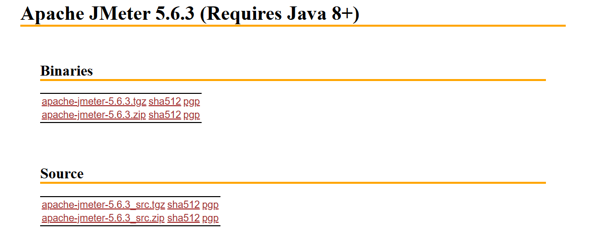

به سایت رسمی JMeter بروید و آخرین نسخه را دانلود کنید:

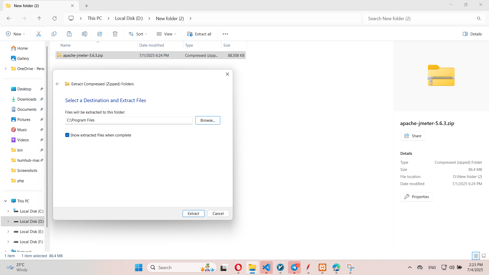

فایل ZIP دانلود شده را در یک پوشه دلخواه استخراج (Extract) کنید.

برای اجرای برنامه:

در ویندوز، jmeter.bat را اجرا کنید.

در لینوکس یا مک، فایل jmeter را اجرا کنید.

## بعد از باز شدن برنامه، آماده‌اید تست خود را بسازید.

## آموزش نصب پلاگین‌ها در JMeter

برای اینکه بتوانید امکانات بیشتری به JMeter اضافه کنید، باید پلاگین‌ها را نصب کنید. راحت‌ترین روش استفاده از Plugin Manager است.

### نصب Plugin Manager:

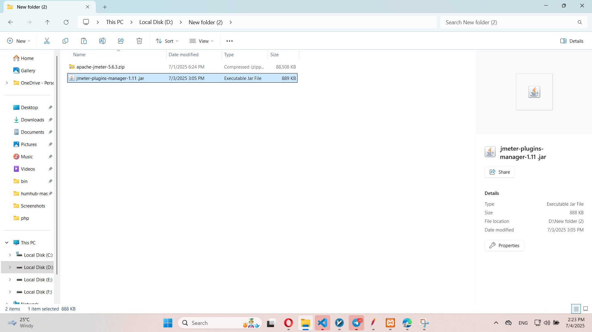

به این صفحه بروید و فایل Plugin Manager را دانلود کنید:
https://jmeter.apache.org/download_jmeter.cgi

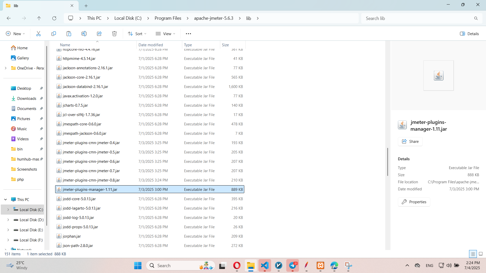

فایل JMeterPlugins-Manager-x.x.jar را داخل پوشه lib/ext که در مسیر نصب JMeter قرار دارد کپی کنید.

JMeter را باز کنید، از منوی بالا به مسیر Options > Plugins Manager بروید.

پنجره Plugin Manager باز می‌شود که لیستی از پلاگین‌ها را نشان می‌دهد.

پلاگین‌هایی که نیاز دارید را تیک بزنید و دکمه نصب را بزنید.

بعد از نصب، ممکن است لازم باشد JMeter را ری‌استارت کنید تا پلاگین‌ها فعال شوند.

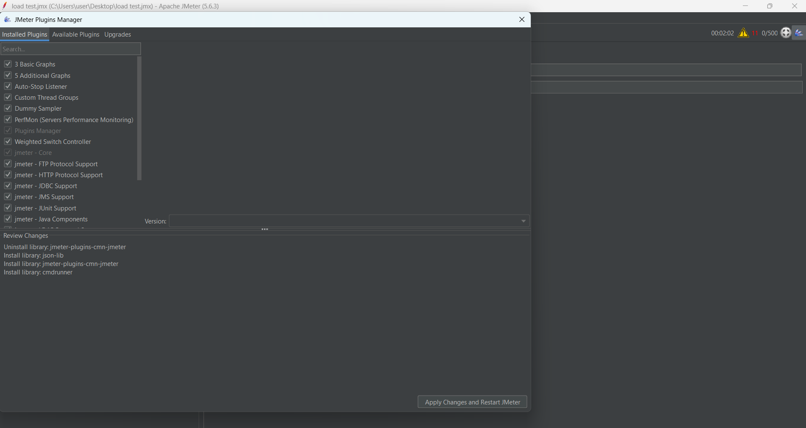

## پلاگین‌های پیشنهادی و کاربرد آن‌ها

### 1. 3 Basic Graphs

نمودارهای ساده اما کاربردی مثل تعداد تراکنش‌ها در ثانیه، تعداد کاربران فعال و زمان پاسخگویی.

### 2. 5 Additional Graphs

مجموعه نمودارهای پیشرفته‌تر برای تحلیل دقیق‌تر پاسخ‌ها.

### 3. Auto-Stop Listener

این پلاگین به شما اجازه می‌دهد تست را بر اساس شرایطی مثل تعداد خطا یا زمان مشخص به‌صورت خودکار متوقف کنید.

### 4. Custom Thread Group

امکان ساخت الگوهای پیچیده برای شبیه‌سازی رفتار کاربران مثل افزایش تدریجی بار یا بار مرحله‌ای.

### 5. Dummy Sampler

ابزاری برای شبیه‌سازی نمونه‌ها بدون ارسال درخواست واقعی که برای تست سناریوهای مختلف کاربردی است.

### 6. (PerfMon (Servers Performance Monitoring

با این پلاگین می‌توانید منابع سرور مانند CPU، حافظه و دیسک را مانیتور کنید.
 نکته: برای استفاده، باید PerfMon Agent روی سرور هدف نصب و اجرا شود.

### 7. Weighted Switch Controller

به شما امکان می‌دهد جریان اجرای تست‌ها را بر اساس درصد یا وزن دلخواه کنترل کنید؛ برای شبیه‌سازی سناریوهای واقعی‌.

# 

# 

# 

# 

# 

# مفاهیم پایه و المان ها در JMeter برای طراحی تست

## 1. 🎯 Sampler

Samplerها وظیفه ارسال درخواست (Request) به سرور رو دارن.

### معروف‌ترین Sampler:

### ✅ HTTP Request

مهم‌ترین Sampler برای تست APIها و صفحات وب

می توان انواع درخواست ها رو ارسال کرد : GET, POST, PUT, DELETE, ...

📌 پارامترهای مهم:

Server Name or IP: دامنه یا IP سرور

Path: مسیر درخواست (مثلاً /login)

Method: متد HTTP

Body Data / Parameters: پارامترهای درخواست

Headers: با کمک HTTP Header Manager جداگانه تنظیم می‌شن

### 

### 

### 📍 مثال:

Method: POST

Path: /content/content/post

Body:

message=Hello world!&_csrf=${csrf_token}

## 2. 📦 Logic Controller

### ✅ Simple Controller

فقط برای مرتب کردن و سازمان‌دهی سناریو استفاده می‌شه.

داخلش می‌تونی چندین HTTP Request بذاری، مثلاً:

Simple Controller → Stream Actions

HTTP Request → Get Feed

HTTP Request → Post Content

HTTP Request → Like Post

🧩 مزایا:

خوانایی بهتر

دسته‌بندی سناریوهای مختلف (مثل login، post creation، profile، stream،…)

📌 فقط نظم‌دهنده‌ست، تاثیری در اجرای درخواست نداره.

## 3. ✅ Response Assertion

### 🎯 برای بررسی صحت پاسخ دریافتی از سرور استفاده می‌شه.

با این ابزار چک می‌کنی که:

آیا متن خاصی در response هست؟

آیا status code درست برگشته؟

آیا response خالی نبوده؟

و...

📌 معمولاً برای هر HTTP Request باید حداقل یک Assertion بذاری.

### 📍 مثال:

بررسی وجود متن "Post successfully created" در response

Response Assertion:

Field to Test: Text Response

Pattern Matching Rules: Contains

Patterns to Test: Post successfully created

### 📍 مثال:

بررسی اینکه Status Code برابر 200 هست

از "Response Code" در assertion استفاده کن

## 4.  سایر اجزای مهم

### 🧾 HTTP Header Manager

برای افزودن Headerهای مورد نیاز، مثل:

Content-Type: application/x-www-form-urlencoded

X-Requested-With: XMLHttpRequest

### 🍪 HTTP Cookie Manager

مدیریت سشن‌ها و کوکی‌ها بین درخواست‌ها

برای احراز هویت و نگه‌داشتن لاگین خیلی مهمه

### 🧪 Debug Sampler

برای تست و بررسی مقادیر استخراج‌شده مثل csrf_token, post_id

خروجی‌اش در View Results Tree نمایش داده می‌شه

### 🪄 Regular Expression Extractor / JSON Extractor

برای استخراج مقادیر مهم از responseها مثل:

CSRF Token

objectId پست‌ها

نام کاربری و …

مثال:

Regular Expression Extractor:

Reference Name: csrf_token

Regular Expression: <meta name="csrf-token" content="(.+?)"

Template: $1$

### 📊 View Results Tree

نمایش کامل response هر درخواست

خروجی‌تون رو ببینید و مشکل‌یابی کنید

### ⏱ Timer (مثلاً Constant Timer)

برای اضافه کردن تأخیر بین درخواست‌ها

شبیه‌سازی کاربر واقعی (مثلاً 2 ثانیه مکث بین لاگین و پست گذاشتن)

## 🧪 هدف آزمون

شبیه‌سازی رفتار کاربران در محیط واقعی برای ارزیابی عملکرد سامانه‌ی شما در شرایط بار (load) بالا و فشار(stress) ، از جمله ورود، ارسال پست، ایجاد نظرسنجی، پیام‌رسانی، لایک/کامنت، مشاهده صفحات و خروج.

## 📋 خلاصه درخواست‌ها

## 📄 توضیحات کامل سناریوها

### 1️⃣ ورود به سیستم

#### GET /user/auth/login

دریافت فرم ورود

استخراج CSRF token از meta یا input

#### POST /user/auth/login

ارسال نام کاربری، رمز عبور و CSRF

نوع داده: application/x-www-form-urlencoded

ورودی:

_csrf=${csrf_token}

LoginLogin[username]=mojtab

[password]=123456789

Login[rememberMe]=1

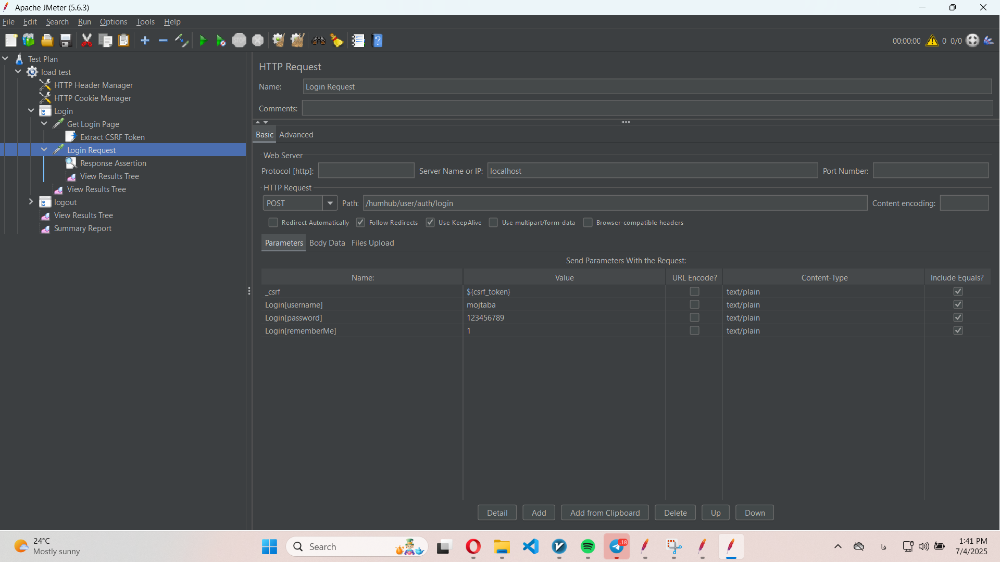

### 2️⃣ ایجاد نظرسنجی در فضای Artist

#### GET /spaces

بررسی وجود فضای artist

#### GET /s/artist/

ورود به فضای مورد نظر

#### GET /s/artist/polls/poll/create-form

دریافت فرم ایجاد نظرسنجی + استخراج CSRF

#### POST /s/artist/polls/poll/create

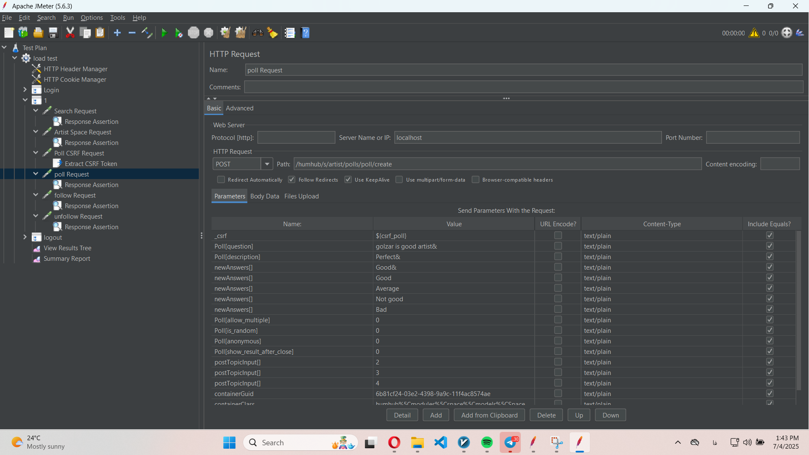

ایجاد نظرسنجی

### 3️⃣ ایجاد نظرسنجی در فضای Car

دقیقاً مشابه مرحله ۲، با فضای /s/car/ و سوال:

سوال نظرسنجی:
 ? What is the Best Car in the World

گزینه‌ها:
 Bugatti, Lamborghini, Samand Soren, Pride, Peugeot405

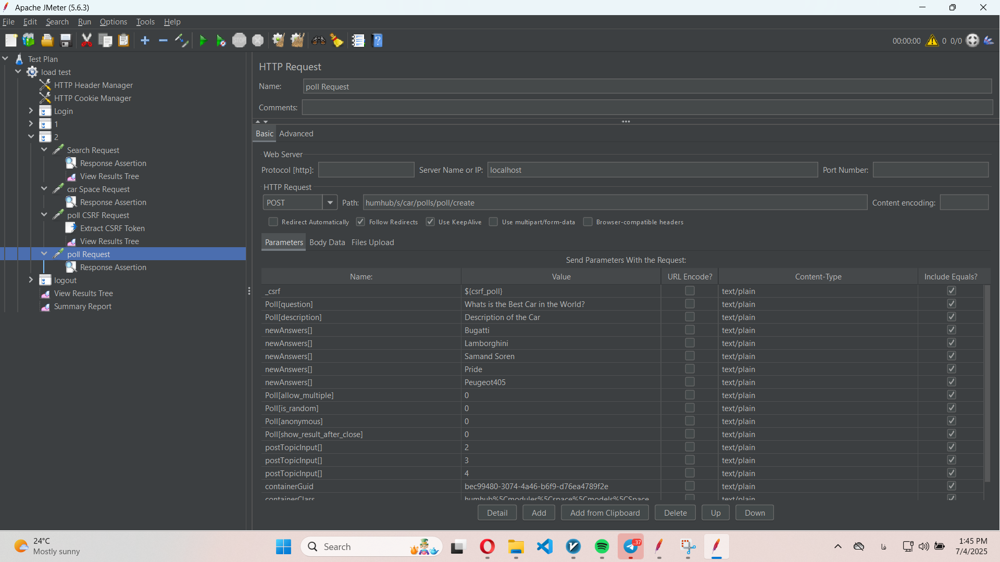

### 4️⃣ پست شخصی

#### GET /dashboard

استخراج CSRF

#### POST /u/mojtaba/post/post/post

ارسال پست روی صفحه خود کاربر

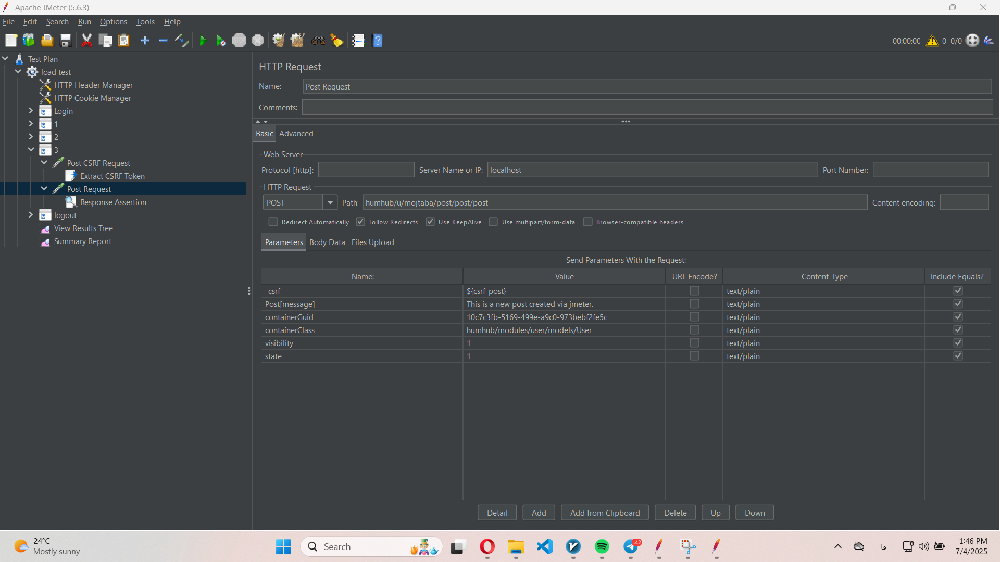

### 5️⃣ ارسال پیام

#### GET /mail/mail/index

مشاهده لیست مکالمات

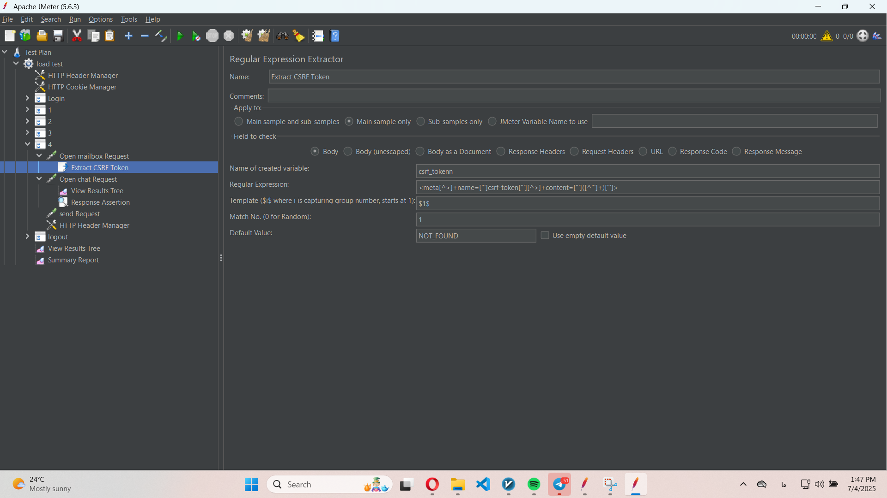

استخراج CSRF

#### GET /mail/mail/show?id=1

مشاهده مکالمه با ID مشخص

#### GET /mail/mail/add-entry?id=1

#### POST mail/mail/reply?id=1

ارسال پیام

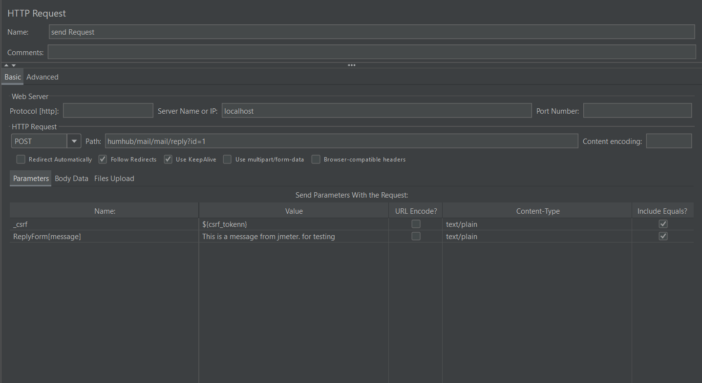

### 6️⃣ ارسال کامنت و لایک

#### GET /dashboard

استخراج CSRF

#### POST /comment/comment/post

ارسال کامنت روی نظرسنجی با ID 6

ورودی:

objectModel=humhub\modules\polls\models\Poll

objectId=6

message=This is a test comment from Jmeter.

#### POST /like/like/like

لایک کردن همان محتوا

#### POST /like/like/unlike

آنلایک کردن همان محتوا

### 7️⃣ مشاهده فضای artist و پروفایل David

#### GET /spaces

جستجوی فضای موجود

#### GET /s/artist

مشاهده فضای artist

#### GET /people?keyword=David Roberts

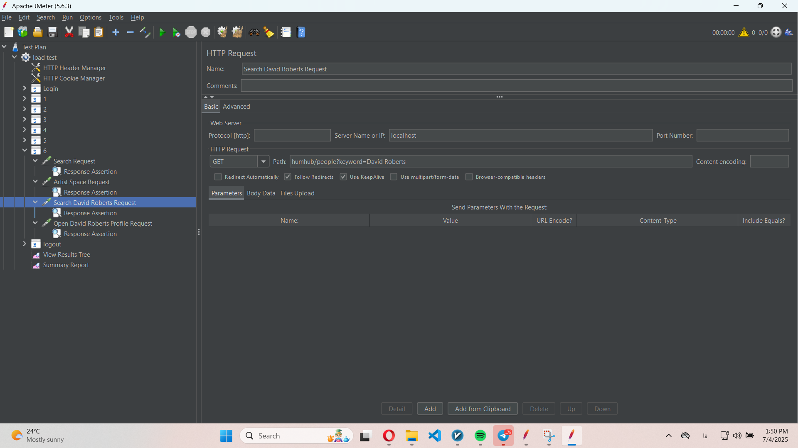

جستجوی کاربر

#### GET /u/david1986

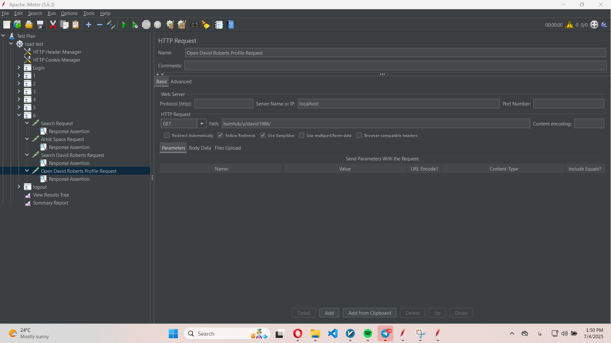

مشاهده پروفایل David

### 8️⃣ باز کردن پست با ID خاص

#### GET /dashboard

مشاهده صفحه کلی

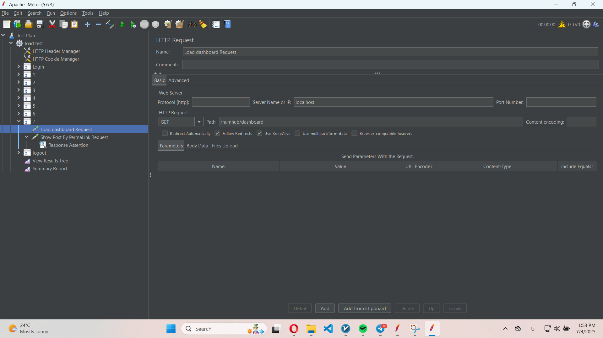

#### GET /content/perma?id=2

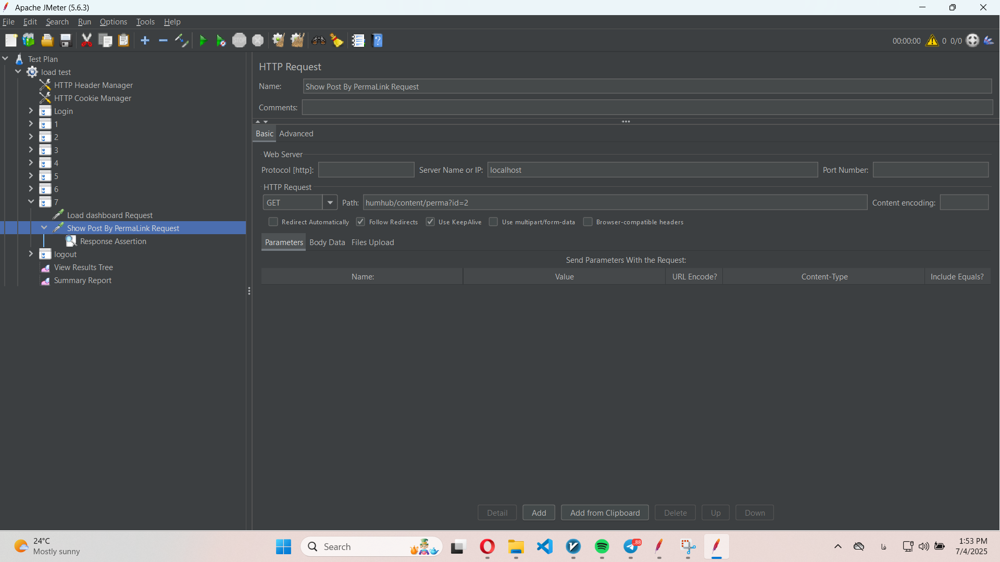

مشاهده پست مشخص

### 9️⃣ مشاهده داشبورد

#### GET /dashboard

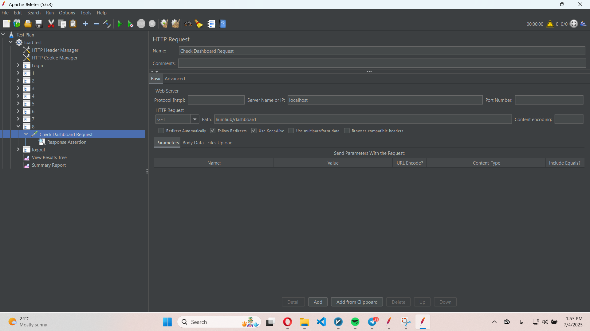

بررسی عملکرد کلی صفحه

بررس درستی عملکرد

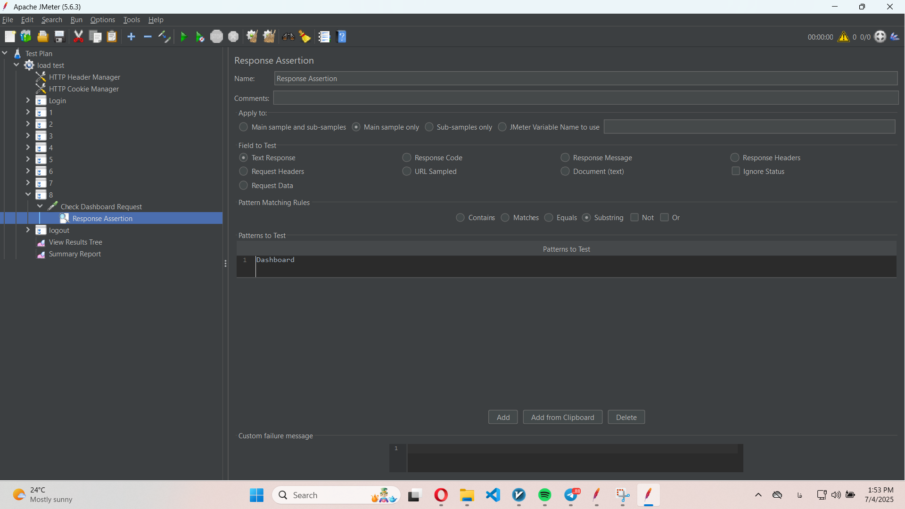

### 🔟 خروج از سیستم

#### GET /dashboard

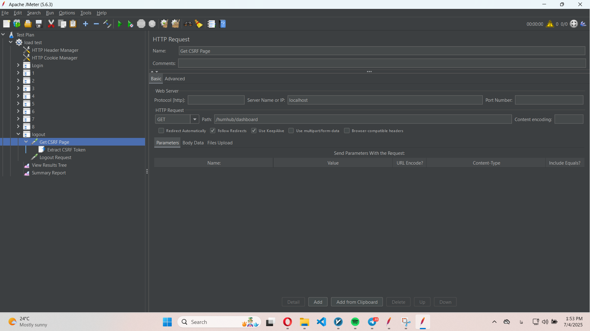

استخراج CSRF

#### POST /user/auth/logout

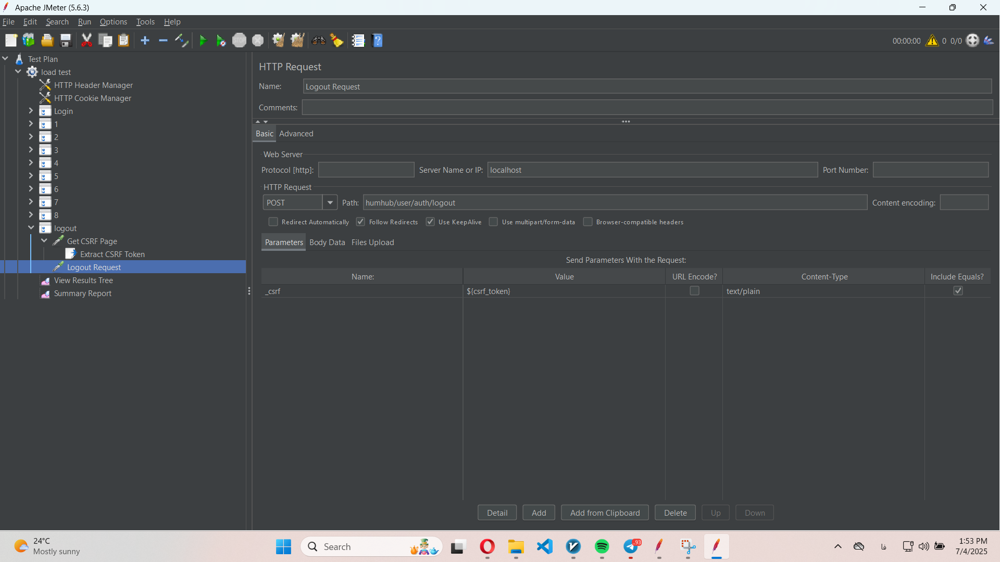

ارسال درخواست خروج

ساختار درختی کامل JMeter Test Plan

Test Plan

└── Thread Group: Load Test Users

├── HTTP Cookie Manager

├── HTTP Header Manager

├── Simple Controller: Login

│   ├── HTTP Request: GET /login

│   ├── RegEx Extractor: csrf_token

│   ├── HTTP Request: POST /login

│   └── Response Assertion: Login Success

│

├── Simple Controller: Scenario 1 - Follow/Unfollow

│   ├── HTTP Request: Search User

│   ├── Response Assertion: Search Result OK

│   ├── HTTP Request: Artist Space

│   ├── HTTP Request: Poll CSRF

│   ├── RegEx Extractor: csrf_token

│   ├── HTTP Request: Poll

│   ├── HTTP Request: Follow

│   ├── Response Assertion: Follow OK

│   ├── HTTP Request: Unfollow

│   └── Response Assertion: Unfollow OK

│

├── Simple Controller: Scenario 2 - Stream & Space

│   ├── HTTP Request: Search Car

│   ├── Response Assertion: Car Search OK

│   ├── HTTP Request: Car Space

│   ├── HTTP Request: Poll CSRF

│   ├── RegEx Extractor: csrf_token

│   ├── HTTP Request: Poll

│   └── Response Assertion: Poll OK

│

├── Simple Controller: Scenario 3 - Post Content

│   ├── HTTP Request: Post CSRF Page

│   ├── RegEx Extractor: csrf_token

│   ├── HTTP Request: POST content/post

│   └── Response Assertion: Post Success

│

├── Simple Controller: Scenario 4 - Messenger

│   ├── HTTP Request: Open Mailbox

│   ├── RegEx Extractor: csrf_token

│   ├── HTTP Request: Open Chat

│   ├── Response Assertion: Chat Loaded

│   └── HTTP Request: Send Message

│

├── Simple Controller: Scenario 5 - Comment & Like

│   ├── HTTP Request: Load Dashboard

│   ├── RegEx Extractor: csrf_token

│   ├── HTTP Request: Load Stream

│   ├── HTTP Request: POST Comment

│   ├── Response Assertion: Comment OK

│   ├── HTTP Request: Like Comment

│   ├── Response Assertion: Like OK

│   ├── HTTP Request: Unlike Comment

│   └── Response Assertion: Unlike OK

│

├── Simple Controller: Scenario 6 - Visit Other Profile

│   ├── HTTP Request: Search People

│   ├── Response Assertion: Search OK

│   ├── HTTP Request: Artist Space

│   ├── HTTP Request: Search David Roberts

│   ├── Response Assertion: David Found

│   └── HTTP Request: Open David's Profile

│

├── Simple Controller: Scenario 7 - Load Post By Permalink

│   ├── HTTP Request: Load Dashboard

│   └── HTTP Request: Show Post by Permalink

│       └── Response Assertion: Post Loaded

│

├── Simple Controller: Scenario 8 - Check Dashboard

│   └── HTTP Request: Check Dashboard

│       └── Response Assertion: Dashboard OK

│

├── Simple Controller: Logout

│   ├── HTTP Request: GET /login

│   ├── RegEx Extractor: csrf_token

│   └── HTTP Request: POST /logout

│

└── Listener: View Results Tree

در انتها نیز بین هر sampler، یک Uniform Random Timer به با تنظیمات زیر قرار داده میشود.

Random Delay Maximum (ms): 400

Constant Delay Offset (ms): 100

زمان انتظار تصادفی بین 0.1 تا 0.5 ثانیه خواهد بود :

Delay = 100ms + random(0–400ms) → 100ms to 500ms

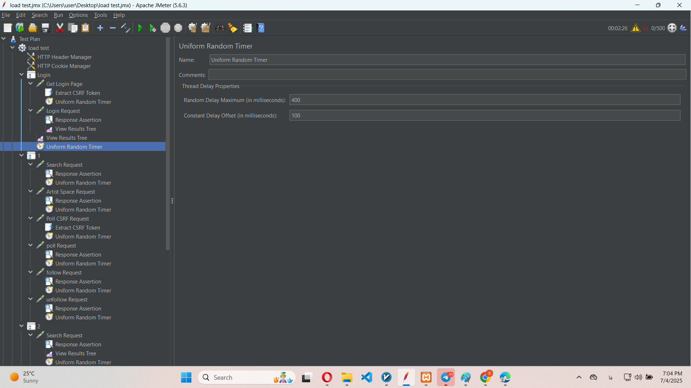

نتایج آزمون بار

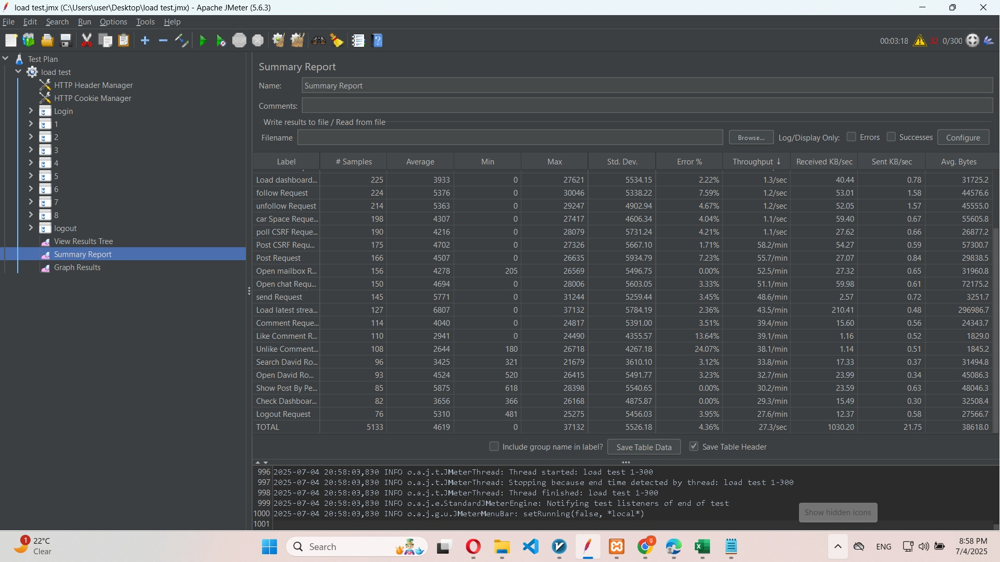

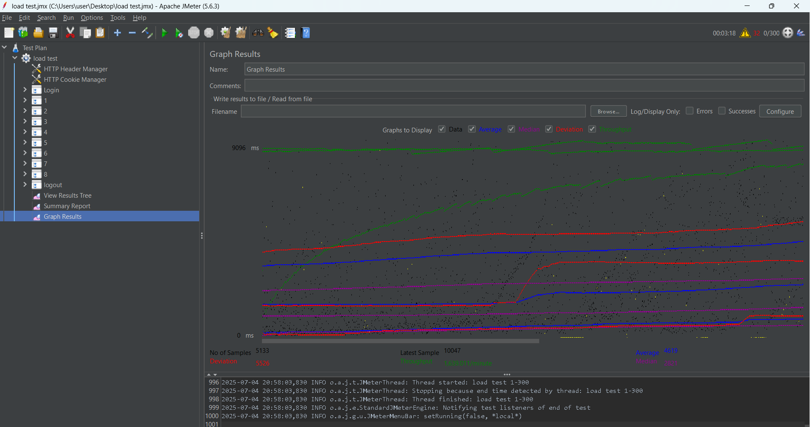

نتایج آزمون فشار

# 

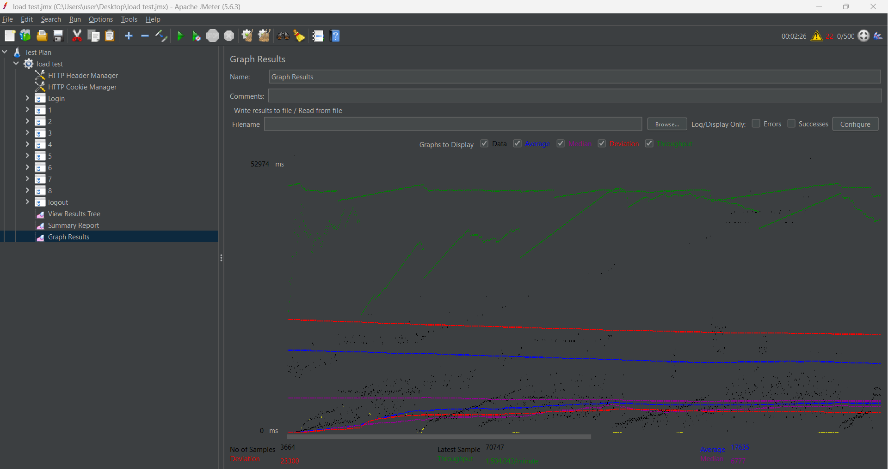

بررسی نتایج آزمون

در این گزارش، عملکرد نرم‌افزار تحت آزمون در دو حالت آزمون بار (Load Test) و آزمون فشار (Stress Test) با استفاده از دو ابزار Locust و Apache JMeter بررسی و مقایسه شده است. آزمون بار به سنجش توان سیستم در برابر بار معمول (در اینجا ۳۰۰ کاربر همزمان با Ramp-Up 120 ثانیه) می‌پردازد، در حالی که آزمون فشار با افزایش مداوم بار تا آستانه شکست سیستم (تا ۱۰۰۰ کاربر و فراتر) توانایی تحمل فشار حداکثری را می‌سنجد. نتایج حاصل از هر دو ابزار جهت یافتن شباهت‌ها و تفاوت‌ها در رفتار سیستم و همچنین ویژگی‌های خود ابزارها تحلیل شده‌اند. در ادامه، ابتدا مقایسه‌ای بین Locust و JMeter در تست بار و سپس در تست فشار ارائه می‌شود. سرانجام جمع‌بندی مختصری از یافته‌ها خواهیم داشت.

## مقایسه‌ی آزمون بار در Locust و JMeter

در آزمون بار با ۳۰۰ کاربر همزمان، هر دو ابزار تصویری کمابیش مشابه از ظرفیت سیستم ارائه دادند. سناریوی تست شامل اقدامات مهمی همچون باز کردن صفحه ورود، ورود به حساب، جستجو، دنبال‌کردن/لغو دنبال‌کردن و ارسال پست بوده است. نتایج عددی JMeter (خلاصه‌شده در فایل گزارش) و مشاهدات Locust نشان می‌دهد سیستم تحت بار ۳۰۰ کاربر قادر به سرویس‌دهی بوده اما با زمان‌های پاسخ نسبتاً بالا و مصرف کامل منابع همراه است. در ادامه شباهت‌ها و تفاوت‌های کلیدی در آزمون بار را بررسی می‌کنیم:

### 

### 

### شباهت‌ها در آزمون بار

توان تحمل بار ۳۰۰ کاربر – هر دو ابزار تأیید کردند که سیستم می‌تواند حدود ۳۰۰ کاربر همزمان را پشتیبانی کند. در این سطح، سیستم دچار فروپاشی نشده و درخواست‌ها را هرچند با تأخیر پاسخ می‌دهد. به عنوان مثال، در هر دو تست مشاهده شد که throughput کل سیستم در حدود ۲۰–۳۰ درخواست در ثانیه بود که نشان‌دهنده‌ی پایدار ماندن سرویس در این سطح بار است. همچنین نرخ خطا پایین و قابل قبول باقی ماند (در حد چند درصد)؛ چنان‌که در گزارش JMeter نرخ خطای کل ~۳٫۵٪ ثبت شد و Locust نیز عدم وقوع خطای جدی را تا این سطح تأیید کرد.

زمان‌های پاسخ قابل مقایسه – هر دو ابزار نشان دادند که زمان پاسخ متوسط برای عملیات‌های اصلی در بار ۳۰۰ کاربر در حد چند ثانیه تا ده‌ها ثانیه است. برای نمونه، در آزمون JMeter بار ۳۰۰ کاربر، میانگین زمان بارگذاری صفحه ورود حدود ۴۲ ثانیه و اقدام ورود حدود ۴۳ ثانیه اندازه‌گیری شد. به طور مشابه، Locust نیز در این سطح بار زمان‌های پاسخ چند‌ثانیه‌ای تا ده‌ها‌ثانیه (بسته به نوع درخواست) را گزارش کرد. این ارقام نشان می‌دهد که تحت بار مذکور سیستم هرچند پاسخ‌گوست، ولی تأخیرهای قابل توجهی در پردازش رخ می‌دهد که ناشی از نزدیک‌شدن به حد ظرفیت سیستم است.

الگوی مشابه اجرای تست – هر دو ابزار سناریوی تست بار را با ramp-up تدریجی کاربران اجرا کردند (در JMeter با پارامتر Ramp-Up 120 ثانیه برای ۳۰۰ کاربر، و در Locust با نرخ افزایش تدریجی کاربران یا Spawn Rate معین). این ramp-up ملایم باعث شد که سیستم به‌تدریج تحت بار قرار گیرد و نتایج پایدارتر و قابل‌مشاهده‌ای حاصل شود. هر دو ابزار طی ramp-up شاهد افزایش متناسب تأخیرها بودند تا جایی که با رسیدن به ۳۰۰ کاربر، زمان‌های پاسخ به سطوح بالا تثبیت شد. این روند تدریجی در هر دو ابزار کمک کرد تا بدون وارد‌آوردن شوک ناگهانی، رفتار سیستم در حال نزدیک‌شدن به آستانه ظرفیت ارزیابی شود.

### تفاوت‌ها در آزمون بار

روش پیاده‌سازی سناریو – JMeter یک ابزار مبتنی بر رابط گرافیکی و استفاده از Thread برای هر کاربر مجازی است، در حالی که Locust کاملاً کدنویسی-محور بوده و از event های مبتنی بر async (توسط پایتون و کتابخانهٔ gevent) برای شبیه‌سازی کاربرها بهره می‌گیرد. در آزمون بار ۳۰۰ کاربر، JMeter با ایجاد ۳۰۰ نخ (Thread) عملیات را اجرا کرد و هر نخ توالی ثابتی از درخواست‌ها (سناریوی تست) را طی نمود. از سوی دیگر، در Locust توسعه‌دهنده سناریو را در قالب توابع پایتونی تعریف کرده و Locust با رویکرد swarm کاربران را به تدریج اضافه نمود. این اختلاف معماری ممکن است بر مصرف منابع مولد بار تأثیر بگذارد (JMeter وابسته به توان CPU/RAM ماشین اجرا، Locust سبک‌تر به دلیل async)، اما در این سطح (۳۰۰ کاربر) هر دو ابزار توانستند بدون مشکل جدی بار را تولید کنند.

جزئیات گزارش‌دهی و شاخص‌های آماری – در خروجی JMeter، جزئیاتی مانند میانگین، مینیمم/ماکزیمم و انحراف معیار زمان پاسخ برای هر نوع درخواست و همچنین درصد خطا و Throughput به صورت جدولی ارائه شد. به طور مثال، JMeter نشان داد میانگین زمان پاسخ کل همه درخواست‌ها ~17.6 ثانیه و حداکثر زمان مشاهده‌شده ~76 ثانیه بوده است. در مقابل، Locust در حین اجرا آمار را به‌صورت بلادرنگ از طریق واسط وب نمایش می‌دهد و تمرکز آن بیشتر بر صدک‌های زمانی پاسخ (مانند median، ۹۵٪ و ۹۹٪) و نرخ درخواست/خطا در لحظه است. برای نمونه، Locust median (زمان پاسخ ۵۰٪ کاربران) و صدک ۹۵٪ را برای هر درخواست گزارش می‌کرد.

نحوه تنظیم و اجرای تست – ایجاد سناریوی تست بار در JMeter با پیکربندی گرافیکی انجام شد، که برای مهندسین تست سنتی‌تر قابل درک است. در Locust همین سناریو با کدنویسی پایتون پیاده‌سازی گردید که انعطاف بالایی به همراه دارد اما نیازمند دانش برنامه‌نویسی است. در عمل، مشاهده کردیم که اعمال تغییرات سریع (مثلاً افزودن یک اقدام جدید در سناریو) در Locust با ویرایش اسکریپت پایتون ساده‌تر بود، در حالی که در JMeter انجام همین تغییرات نیازمند تنظیم مجدد عناصر گرافیکی و اطمینان از صحیح بودن سلسله‌مراتب تست بود. با این حال، خروجی نهایی هر دو ابزار برای آزمون بار یکسان بوده و تفاوت در روش پیاده‌سازی تأثیری بر نتیجه عملکردی سیستم نداشت، بلکه صرفاً بر فرآیند تولید بار و جمع‌آوری نتایج اثرگذار بود.

## 

## 

## 

## مقایسه‌ی آزمون فشار در Locust و JMeter

آزمون فشار با هدف تعیین آستانهٔ ظرفیت سیستم انجام گرفت. در این سناریو، بار ابتدا در سطح قابل تحمل شروع شده و سپس تا حد فروپاشی سیستم افزایش یافت. تیم تست با استفاده از Locust تعداد کاربران را به تدریج به ۱۰۰۰ افزایش داد تا رفتار سیستم در نزدیکی نقطه اشباع مشاهده شود. در سمت JMeter نیز سناریویی متناظر قابل پیاده‌سازی بود (مثلاً افزایش کاربران در چند مرحله‌ی پیاپی)، اگرچه در عمل عمده اطلاعات آزمون فشار از نتایج Locust به‌دست آمد. نتایج نشان داد که سیستم تحت آزمون پس از حدود ۳۰۰–۴۰۰ کاربر وارد ناحیه اشباع می‌شود و فراتر از آن، زمان‌های پاسخ به شدت افزایش یافته و نرخ خطا زیاد می‌گردد. شکل زیر منحنی تغییرات زمان پاسخ نسبت به تعداد کاربر در آزمون فشار Locust را نمایش می‌دهد:

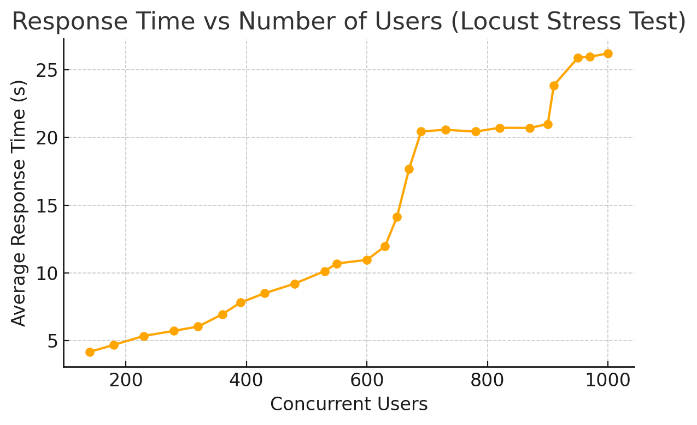

نمودار ۱ -

رابطه میان تعداد کاربران همزمان و میانگین زمان پاسخ سیستم در آزمون فشار با Locust. دیده می‌شود که با افزایش کاربران به نواحی نزدیک ۷۰۰ به بالا، زمان پاسخ به صورت تصاعدی افزایش یافته و از حدود ۵–۱۰ ثانیه به بازه ۲۰+ ثانیه و بیشتر صعود کرده است. پس از رسیدن به ~۱۰۰۰ کاربر، سیستم عملاً اشباع شده و بهبود بیشتری در Throughput مشاهده نمی‌شود

در ادامه، شباهت‌ها و تفاوت‌های کلیدی در آزمون فشار Locust و JMeter مورد بحث قرار گرفته است:

### شباهت‌ها در آزمون فشار

آستانه شکست یکسان سیستم – هر دو ابزار حاکی از آن بودند که نقطه ظرفیت نهایی سیستم تحت تست حدود ۳۰۰ الی ۴۰۰ کاربر همزمان است. در Locust مشاهده شد که از حدود ۳۵۰ کاربر به بعد، منحنی زمان پاسخ شیب تندی پیدا کرد و سیستم دیگر نتوانست با افزایش کاربران، Throughput را بالا ببرد (نشانهٔ اشباع شدن). به طور مشابه، در صورت استفاده از JMeter برای افزایش کاربران به سطوح بالاتر، انتظار می‌رود همان رفتار دیده شود: یعنی پس از حدود چندصد کاربر، سرورها به نرخ ماکزیمم خود رسیده و با افزایش بار فقط زمان پاسخ و نرخ خطا افزایش می‌یابد بدون افزایش قابل توجه در تعداد درخواست‌های پردازش‌شده. بنابراین هر دو ابزار تصویری هم‌راستا از سقف ظرفیت سیستم ارائه می‌دهند و تایید می‌کنند که سیستم تحت آزمون بیش از ۳۰۰ کاربر همزمان را به شکل پایدار نمی‌تواند پاسخ دهد.

بروز تأخیر زیاد و خطا در بار بیش از ظرفیت – در آزمون فشار Locust با نزدیک‌شدن به ۱۰۰۰ کاربر، زمان‌های پاسخ بسیار بالا و خطاهای متعدد مشاهده شد که ماهیتاً همان چیزی است که یک آزمون فشار با JMeter نیز نشان می‌داد. به عنوان نمونه، در Locust میانگین زمان پاسخ کل که در بار ~۳۰۰ کاربر حدود ۶ ثانیه بود【20†】، در انتهای تست (نزدیک ۱۰۰۰ کاربر) به بیش از ۴۰ ثانیه افزایش یافت【20†】. همچنین میانگین زمان پاسخ درخواست اصلی داشبورد در لحظات اوج به ~۸۵ ثانیه (median = 87s) رسید که بیانگر کندی شدید سیستم است. در همین حال، نرخ خطا رو به افزایش گذاشت؛ برای مثال برخی درخواست‌ها که در شرایط عادی موفق بودند، تحت فشار شدید همگی با خطا مواجه شدند. در گزارش Locust دیده شد که تمامی ۱۸ تلاش برای ثبت پست در داشبورد در طی آزمون فشار شکست خورد (۱۰۰٪ خطا). چنین وضعیتی در JMeter نیز متناظر دارد: انتظار می‌رود در صورت اعمال ۱۰۰۰ کاربر، بسیاری از نمونه‌ها Timeout شده یا با کدهای خطای سرور مواجه شوند و شاید حتی Thread های تست به استثنائات برخورد کنند. در نتیجه، هر دو ابزار نشان می‌دهند که فراتر از ظرفیت تحمل، سیستم با تأخیرهای بسیار بالا (ده‌ها ثانیه) و درصد خطای چشمگیر مواجه می‌شود که معیار ناکارآمدی در آن سطح بار است.

ماهیت تدریجی افزایش بار – اگرچه رویکرد فنی Locust و JMeter در اعمال بار متفاوت است، هر دو می‌توانند آزمون فشار را به صورت مرحله‌ای و تدریجی انجام دهند تا نقطه شکست مشخص گردد. در تست Locust تیم ما به صورت برخط کاربران را پله‌پله افزایش داد (مثلاً ۵۰ کاربر هر چند ثانیه) و در JMeter نیز می‌توان همین را با Step Thread Group یا سناریوی چندمرحله‌ای شبیه‌سازی کرد. شباهت در اینجا آن است که روش آزمون فشار مستقل از ابزار، شامل افزایش پیوسته بار و مشاهدهٔ علائم اشباع (افزایش زمان پاسخ، صف، کاهش نرخ پاسخ‌گویی و بروز خطا) است. بنابراین خروجی هر دو در تعیین آستانه مشابه خواهد بود، هرچند Locust امکان کنترل و مشاهده لحظه‌ای طی افزایش را ساده‌تر فراهم می‌کند.

### تفاوت‌ها در آزمون فشار

توانایی تولید بار بسیار بالا – یک تفاوت عملی مهم، ظرفیت خود ابزار برای ایجاد کاربران بسیار زیاد است. JMeter به دلیل استفاده از نخ‌های سیستم عامل، با محدودیت منابع ماشین اجرا مواجه است و راندمان آن در بارهای بسیار بزرگ (مثلاً هزاران کاربر) کاهش می‌یابد. در مقابل، Locust به صورت توزیع‌شونده طراحی شده و می‌تواند با افزودن نودهای Worker بار را بین چند ماشین تقسیم کند. بدین ترتیب، برای آزمون فشار فراتر از ۱۰۰۰ کاربر، Locust مقیاس‌پذیری بهتری از خود نشان می‌دهد؛ مثلاً می‌توان ۵۰۰۰ کاربر را روی ۵ سرور مولد بار توزیع کرد. هرچند در سناریوی حاضر هر دو ابزار توانستند ۱۰۰۰ کاربر را (روی یک ماشین مولد) ایجاد کنند، اما در تست‌های سنگین‌تر Locust این مزیت توزیع‌شدگی را داراست در حالی که راهکار JMeter شامل اجرای توزیع‌یافته پیچیده (Master/Slave) است. خلاصه اینکه برای بارهای فوق سنگین Locust مناسب‌تر و منعطف‌تر است، در حالی که JMeter عملاً در محدودۀ کمتری (وابسته به توان دستگاه اجرا) جوابگوست.

نحوه پایش و قطع تست در آستانه اشباع – در Locust، تیم آزمون به صورت زنده مشاهده کرد که پس از رسیدن به ~۷۰۰ کاربر، نرخ پاسخ‌دهی دیگر افزایش نیافت (Around ~16 RPS ثابت ماند) و صف‌ها بلندتر شدند. این امکان پایش بلادرنگ به ما اجازه داد دقیقاً در لحظه مشاهده نشانه‌های ناپایداری (افزایش شدید زمان پاسخ و خطا) تست را متوقف یا تثبیت کنیم. در JMeter (اجرای غیرگرافیکی)، چنین مشاهده لحظه‌ای دشوارتر است و معمولاً باید آزمون را تا انتها ادامه داد و سپس نتایج را تحلیل کرد. البته می‌توان با افزونه‌های مانیتورینگ یا اتصال به InfluxDB/Grafana در هنگام اجرای JMeter نیز روندها را دید، اما به صورت پیش‌فرض Locust این نظارت لحظه‌ای را در رابط وب ارائه می‌دهد. بنابراین در آزمون فشار Locust تعامل‌پذیری بیشتری وجود داشت؛ مثلاً ما توانستیم به محض مشاهده ۳۳٪ خطا در برخی درخواست‌ها، نرخ افزایش کاربران را کند یا متوقف کنیم. در JMeter چنین کنترلی به راحتی میسر نیست (مگر توقف دستی کل تست). این تفاوت به آزمون‌گر امکان می‌دهد در Locust رفتار سیستم را مرحله به مرحله ارزیابی و از وارد کردن آسیب غیرضروری به سرور (مثلاً ریزش کامل) اجتناب کند.

ثبت و تحلیل جزئی شکست‌ها – در تست Locust هنگام فشار حداکثری، جزئیات خطاها (مانند Tracebackهای Python برای درخواست‌های timeout یا کدهای HTTP خطا) در فایل‌های خروجی Locust ثبت شد که برای debug سریع مفید بود. از سوی دیگر، JMeter در صورت وقوع خطا معمولاً فقط کد وضعیت HTTP یا پیام خطا را در لاگ ثبت می‌کند و جزئیات تکمیلی کمتری (مثلاً استثناهای شبکه) نشان می‌دهد. برای نمونه، Locust در فایل خروجی استثناها (exceptions.csv) تمام موارد Timeout را با جزئیات stack trace مشخص کرده بود، در حالی که JMeter فقط شمار خطاها را در خروجی CSV ذکر می‌کند. این بدین معناست که در شرایط استرسی Locust اطلاعات عمیق‌تری از علل شکست ارائه داد (به خاطر ماهیت کدنویسی آن)، اما JMeter برای یک تحلیل عمقی علل خطاها شاید نیاز به پیکربندی اضافی (مانند LogLevel بالاتر یا فعال کردن Debug Sampler) داشته باشد.

## نتیجه‌گیری

به طور خلاصه، هر دو ابزار Locust و Apache JMeter توانستند چشم‌انداز مشابهی از توان عملکردی و نقاط ضعف سیستم تحت تست به ما ارائه دهند. در آزمون بار ۳۰۰ کاربر، هر دو تأیید کردند که سیستم قادر به سرویس‌دهی است اما با زمان‌های پاسخ نسبتاً طولانی (در حد چندین ثانیه) و استفاده حداکثری از منابع که منجر به throughput حدود ۲۵ درخواست/ثانیه شد. در آزمون فشار، هر دو نشان دادند که فراتر از حدود ۳۰۰–۴۰۰ کاربر، عملکرد سیستم به شدت افت می‌کند؛ به طوری که در ۱۰۰۰ کاربر میانگین زمان پاسخ به ده‌ها ثانیه افزایش یافته و بخشی از درخواست‌ها با خطا مواجه شدند. این نتایج حاکی از آن است که آستانه ظرفیت سیستم حدود ۳۰۰ کاربر همزمان است و برای بارهای بیش از آن نیاز به بهینه‌سازی یا افزایش ظرفیت (افزودن سرور، بهبود کد، ارتقای سخت‌افزار) وجود دارد.

از منظر مقایسه ابزارها، می‌توان گفت Locust و JMeter هر دو برای آزمون‌های بار و فشار کارآمد هستند اما هر یک رویکرد و مزایای خاص خود را دارند. Locust با رویکرد مبتنی بر کدنویسی و معماری توزیع‌شونده، در تست‌های مدرن (مخصوصاً یکپارچه با CI/CD و سناریوهای نیازمند مقیاس‌پذیری بالا) انعطاف و توان بیشتری نشان می‌دهد. از سوی دیگر، JMeter به عنوان یک ابزار قدیمی‌تر و پایدار، دارای اکوسیستم غنی پلاگین‌ها و قابلیت‌های گزارش‌دهی آماده است که برای گزارش‌های تحلیلی جامع و آزمون‌های استاندارد سازمانی بسیار مفید می‌باشد. در این پروژه، ترکیب خروجی هر دو ابزار به ما کمک کرد تا تصویر دقیقی از عملکرد سیستم به دست آوریم: Locust روند لحظه‌ای افزایش تأخیر و ظهور خطا را به خوبی نشان داد و JMeter جزئیات کمی‌ و کیفی نتایج را در قالب قابل استناد ارائه کرد. به طور کلی، شباهت نتایج به‌دست‌آمده از Locust و JMeter صحّت آزمون‌ها را تقویت کرد و اعتماد به اینکه مشاهده‌شدن ناپایداری سیستم از یک آستانه کاربر به بالا واقعیت داشته و ناشی از نقص روش آزمون نبوده است را افزایش داد. در نهایت، این مطالعه تأیید می‌کند که برای بهره‌برداری از حداکثر توان یک سیستم و تعیین دقیق نقاط شکست آن، به‌کارگیری همزمان چند ابزار و دیدگاه می‌تواند ارزشمند باشد. منابع و نتایج هر دو ابزار در کنار هم نشان دادند که برای سیستم مورد بررسی، توان پاسخ‌گویی همزمان حدود ۳۰۰ کاربر بوده و جهت پشتیبانی کاربران بیشتر نیاز به اقدامات ارتقایی خواهد بود.
