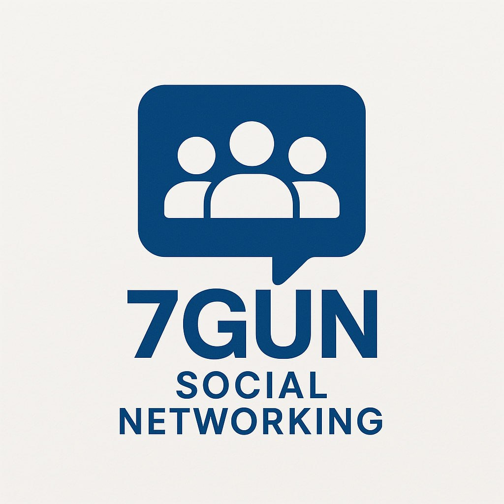

  

# 🚀 پروژه شبکه اجتماعی سازمانی

## 📖 فهرست مطالب
- [📌 معرفی پروژه](#-معرفی-پروژه)
- [🗂 فازهای پروژه](#️-فازهای-پروژه)
- [✅ نیازمندی‌های فاز اول](#-نیازمندیهای-فاز-اول)
- [🛠 ابزار طراحی](#️-ابزار-استفادهشده-برای-طراحی-فاز-اول)
- [📂 مدیریت پروژه (GitHub)](#-ساختار-مدیریت-پروژه-github)
- [📅 تقسیم‌بندی و پیشرفت Sprintها](#-تقسیمبندی-و-پیشرفت-پروژه-در-قالب-sprint)
- [🎨 دسترسی به پروتوتایپ‌ها](#-دسترسی-به-پروتوتایپها-فاز-اول)
- [📚 گزارش نهایی فاز اول](#-گزارش-نهایی-فاز-اول)
- [👥 اعضای تیم](#-اعضای-تیم-پروژه-فاز-اول)

---

## 📌 معرفی پروژه
این پروژه، در قالب درس **مهندسی نرم‌افزار دانشگاه گیلان (ترم ۱۴۰۳)** و زیر نظر **دکتر فرید فیضی** در حال انجام است. هدف کلی این پروژه، طراحی و پیاده‌سازی یک شبکه اجتماعی داخلی و اختصاصی برای سازمان‌ها است.

پروژه در چندین فاز اجرا می‌شود. نسخه کنونی این مستند مربوط به **فاز اول (طراحی پروتوتایپ نسخه تلفن همراه)** است. در این فاز تمامی صفحات ضروری شامل ورود، ثبت‌نام، بازیابی رمز عبور، پروفایل کاربر، فید خبری، پیام‌رسان، گروه‌ها، انجمن‌ها و رویدادها طراحی شده و پروتوتایپ‌های تعاملی آن‌ها به کمک ابزار فیگما ایجاد شده است.

---

## 🗂 فازهای پروژه
پروژه در چند فاز مختلف با اهداف زیر تعریف شده است:

- **فاز اول:** طراحی رابط کاربری (نسخه تلفن همراه) *(فاز فعلی)*
- **فازهای بعدی:**  جزئیات مربوط به هر فاز، همزمان با پیشرفت پروژه و در زمان اجرای آن، به این مستند اضافه خواهد شد.

---

## ✅ نیازمندی‌های فاز اول

- اشتراک محتوای متنی، تصویری، ویدئویی و نظرسنجی‌ها
- سیستم ثبت‌نام، ورود و بازیابی رمز عبور
- صفحات نمایه (پروفایل) و فید خبری (Feed)
- سیستم پیام‌رسان (چت خصوصی و گروهی)
- مدیریت گروه‌ها و انجمن‌ها (ایجاد و ویرایش)
- مدیریت رویدادها (ایجاد، مشاهده و دعوت)

---

## 🛠 ابزار استفاده‌شده برای طراحی فاز اول
پروتوتایپ‌ها با ابزار **Figma** طراحی شده‌اند.

<ul>
  <li>طراحی تعاملی (Interactive Prototype)</li>
  <li>همکاری تیمی همزمان</li>
  <li>مدیریت متمرکز و جامع طراحی‌ها</li>
  <li>استفاده از دیزاین‌سیستم‌ها:
    <ul dir="rtl">
      <li>Material 3</li>
      <li>Bootstrap 5 FA</li>
    </ul>
  </li>
</ul>

---

## 📂 ساختار مدیریت پروژه (GitHub)
مدیریت پروژه از طریق GitHub و با قالب استاندارد **Team Planning** انجام شده است. تعاملات تیمی از طریق کامنت‌گذاری روی Issueها بوده است.

<ul>
  <li>مدیریت Issueها با Labelهای مشخص:
    <ul dir="rtl">
      <li>⚫ <strong>Initialize:</strong> راه‌اندازی و تنظیمات اولیه</li>
      <li>🔵 <strong>Documentation:</strong> مستندسازی و نگارش گزارش‌ها</li>
      <li>🟢 <strong>UI/UX:</strong> طراحی رابط کاربری و تجربه کاربری</li>
    </ul>
  </li>
</ul>

---
## 📅 تقسیم‌بندی و پیشرفت پروژه در قالب Sprint
فاز اول پروژه در قالب سه **اسپرینت 3 تا 5 روزه** سازماندهی و اجرا شد.

<ul dir="rtl">
  <li><strong>Sprint اول (۱۳ تا ۱۶ فروردین)</strong>
    <ul dir="rtl">
      <li>راه‌اندازی اولیه پروژه</li>
      <li>طراحی صفحات اصلی (ورود، ثبت‌نام، نمایه، فید خبری و گفت‌وگو)</li>
      <li>تنظیم مستندات اولیه پروژه</li>
      <li>📖 <a href="Sprint1-summary.md"> گزارش Sprint1 </a></li>
    </ul>
  </li>

  <li><strong>Sprint دوم (۱۷ تا ۱۸ فروردین)</strong>
    <ul dir="rtl">
      <li>طراحی صفحات پیشرفته‌تر (مدیریت گروه‌ها، انجمن‌ها، رویدادها)</li>
      <li>بررسی و رفع مشکلات رابط کاربری</li>
      <li>📖 <a href="Sprint2-summary.md"> گزارش Sprint2 </a></li>
    </ul>
  </li>

  <li><strong>Sprint سوم (۱۹ تا ۲۲ فروردین)</strong>
    <ul dir="rtl">
      <li>یکپارچه‌سازی و لینک‌دهی صفحات</li>
      <li>ویرایش نهایی رابط کاربری و رنگ‌بندی‌ها</li>
      <li>تکمیل گزارش نهایی فاز اول</li>
      <li>📖 <a href="Sprint3-summary.md"> گزارش Sprint3 </a></li>
    </ul>
  </li>
</ul>

---

## 🎨 دسترسی به پروتوتایپ‌ها (فاز اول)
پروتوتایپ‌های تعاملی این فاز را می‌توانید از طریق لینک زیر مشاهده کنید:

🔗 [مشاهده پروتوتایپ‌ در فیگما](https://www.figma.com/proto/W1udGOCI5g6WOiMc4S9GMT/Social-Network---7gun?node-id=76-16&p=f&t=Fi0BvzwqdMgvuA3j-0&scaling=scale-down&content-scaling=fixed&page-id=0%3A1)
🔗 [مشاهده پروژه در فیگما](https://www.figma.com/design/W1udGOCI5g6WOiMc4S9GMT/Social-Network---7gun?node-id=0-1&p=f&t=Fi0BvzwqdMgvuA3j-0)

---

## 📚 گزارش نهایی فاز اول
جزئیات کامل فاز اول شامل تقسیم وظایف، طراحی صفحات، دلایل انتخاب ابزار و روند کلی اجرا در گزارش نهایی زیر آمده است:

📖 [مشاهده گزارش نهایی فاز اول](https://docs.google.com/document/d/16yNkjdHMuNY2Qr_G1Uqiz4pqbTHJamUH/edit?usp=sharing&ouid=101601006722367121274&rtpof=true&sd=true)

---

## 👥 اعضای تیم پروژه

- ارسطو حقیقی
- سارا رکنی دوست
- مجتبی خالقی
- محمدامین محمدی نژاد
- امیرحسین جامعی
- امین محمدی
- نجمه کوهسار

---

> **نکته مهم:**  
> این فایل (README.md) با پیشرفت پروژه به‌روز‌رسانی خواهد شد و جزئیات فازهای بعدی در زمان اجرای هر فاز، اضافه می‌شوند.

---
